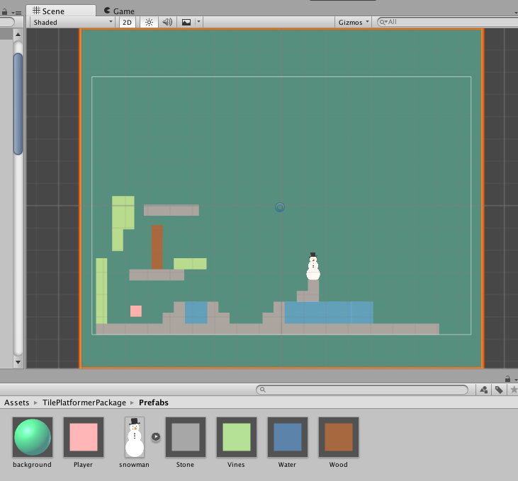
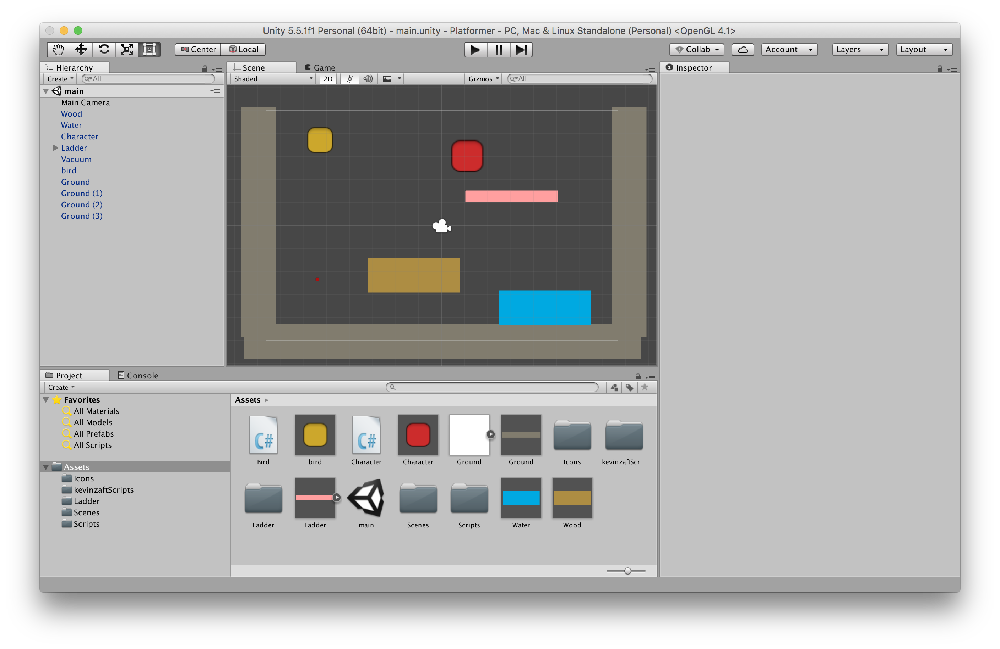

# Platformer

uOttawa game dev club project. Live demo hosted [here](https://uottawagdc.github.io/Platformer/PlatformerDemo) 

# Development

1 Clone this git repo to your desktop. 

2 Start unity

3 Open the "PlatformerBuild" folder in unity to run the working build of the game

# TilePlatformerPackage Folder

# Past Screenshot

This screenshot demonstrates what the build should look like when opened in unity

